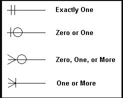
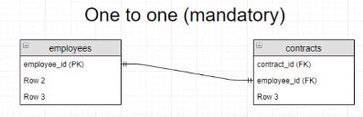
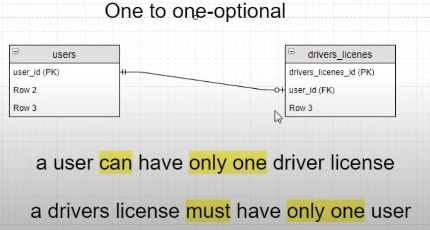
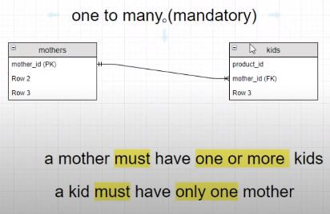
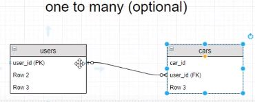
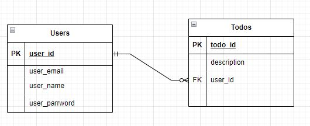
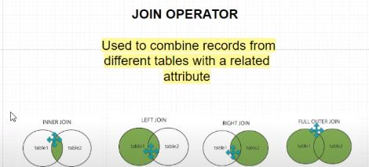

# DataBase Design

- I am using this video (https://www.youtube.com/watch?v=l3njf_tU8us) to learn some basics on database design and how we build tables with relationships for things like websites with user logins and each users has specific posts or likes that we want to correalte with that user, etc
- The motivation is to add users to my simple todo list app, then carry this over to more advanced larger apps later

## Visualizing Database Relationships

- We can use the website draw.io that lets us build "Entity Relationship Diagrams" that help us visualize how data in databases are connected
- we see int he defualt diagram that we have a customers table, a Order Table, and a Shipment table, and in each of them we have a 'PK' (primary key) label, and a 'FK' (foreign key) label, and we will go over all of this
- In these diagrams, the "Entities" are our tables in our database, and each Entity has "Attributes", and these are like the columns of our tables, the attributes of each data type
- so the Entity Relationship Diagrams (ERD) show us the entities in a database and the relationship the entities have with eachother 

### Primary Keys

- the primary key is the unique identifier of the item in a table
- we can see how this is important in an example scenario where we have a tbale of users, lets say we used their first name, last name, and age to define them, we would very quickly end up in a scenario where we had two items with data tuples of `(john, smith, 30)`, and we would have no way to uniquely identify them
    - note, we call all the data entires in a row a tuple here
- so we would want to introduce an `person_id` column where each person was given an unique id number, this acts the primary key in this scenario, it is the means by which we can uniquely identify each item in the table, and they must never overlap or be duplicates
- now the ID style is the most obvious form, but it doesnt need to be an ID number, the primary key can also be multiple data items, like we could say the primary key was (first_name, height), which means if two names or two heights overlap thats okay, but every name/height pairing must be unique (**and this is a terrible terrible PK since again we would be limited by this very quickly**)
- so with this we can build a table in our little drawing software to represent a person, and this is just a visualization software, so we can just make a simple table with entries in the drawing board and give the person ID a PK ag in front of it
- note in this software we do not put in items or rows, we just list how the data is going to be arranged, so we can visualize the structure of the DB
- Now our primary key has 3 criteria:
    1. it can never change
    2. it cant be null 
    3. must uniqely identify 1 row in the table 
- we can never have it change since otherwise it can be edited to overlap with a different item, and in this case we end up violating rule 3
- now there are also 3 ways to create a primary key:
    1. surrogate key: generated value, like incremented ID or randomly generated identifier 
    2. natural key: using an attribute that already exists
    3. composite key: combining multiple attributes
- so our person_id from above is a surrogate key, whereas the (name, height) thing would be a composite ey and also would be natural as well
- **for surrogate keys**, we often use Universally Unique Identifier for IDs (https://en.wikipedia.org/wiki/Universally_unique_identifier), which are long strings that are often shown in  base16, with a 8-4-4-4-12 format: `xxxxxxxx-xxxx-xxxx-xxxx-xxxxxxxxxxxx`, where each x is a base16 character (0 to f), and each character takes 4 bits to store 
    - they are generated randomly, so we dont actually check if there is overlap, which seems wild, but because of the large number of possibilities, we would need to generate 2.71E18 strings to have 50% chance of a single collision, which is wild
- **for a natural key**, a common example is to use a social security number for the government for example, but we wouldnt want to use this for online stuff since we dont need to have people enter their SSN to sign up for a website
- again **for composite key**, we use two different identifiers, so we could use email and phone number or something, but then we would need to have both and people not enter fake ones for a website
- in general we call attributes or sets of attributes that could quialitfy as a PK a **candidate key**

## ToDo DataBase Design

- okay so we want to design the database with our little drawer for the the ToDo app with login functionality
- here we would have 2 tables, each are simple enough on their own
- we would have a our `users` table with 4 rows: `PK`-`user_id`, `user_name`, `user_email`, `user_password`
- then we would have our `todos` table with just 3 rows: `PK`-`todo_id`, `description`, `FK`-`user-id`
- so here we see the tables are linked by the `todos` items having a "foreign key" of a `users` item "primary key", this ensures it is linked to a single unique user
- we will go over more what foreign keys really are and how they work:

## Foreign Keys

- the foreign key is what builds relationships between the tables
- we can imagine our `todos` table holds all todo items for the everyone, and in that table the `users_id` FK column holds different `user_id`'s depending on who created the todo
- it is very important that the FK in the todos table is the PK of the table it points to, otherwise if we used `user_name` as the FK of the `todos` table, we could see there are a ton of user items that have a `user_name` of 'chris' for example (in a site where they allow non-unique usernames)
- so we build realtionships between the tables, and in the little database drawing tool we display this by giving the `user_id` in the `todos` table a header of FK, and then we can use something called *crows foot notation* to draw little arrow type relationships between the linked data attributes 

### Crows Foot Notation

- so there are different arrow type things used for drawing database relationships:

    

- so when we draw these on tables, each end is connected to an attribute in a data table, and the symbol at the each end of the arrow tells us the type of relationship between the attributes 

    

- for example, the first arrow with the two single vertical lines means that there must be only a single element from that attribute, we can image an `employees` table and a `contracts` table, where an `employee_id` is the PK of `employees` and also the FK of `contracts`, we draw a connection between them with the "exactly one" cap at each end since an employee must have only one contract, and each contract must have only one employee it is for 

    

- we can also use one to one optional relationships, so we see a `users` table and a `drivers license` table here, and we know in real life, each user *can* have a *single* drivers license, so we can only have 1 but it is optional whether we have one or not, so 0 or 1, but then for every drivers license, each license *must* have exactly 1 user
- so here we have an asymmetric relationship, so we notice the drivers license NEEDS a user, so the arrow cap on the user side has the exactly 1 symbol, so it is like an arrow pointing from the license user_id FK to the person user_id PK and the arrow tip shows the relationship from the drivers license perspective, conversely, the user can have 1 license, so the arrow direction from person user_id PK to license user_id FK has an arrow tip for "0 or 1"

    

- so one more example here, we have a mothers table and a kids table, and here we see since we define the person as a "mother", they must have at least one kid, so the arrow from `mother` to `kids` has a cap of '1 or more' (or many mandatory), while the arrow from kids to mother has the cap of 'exactly 1' since each child has 1 biological mother

    

- okay actually lastly we have one to many optional, a users table and cars table, where a car has a single owner, but it may not be owned as well, so we have a '0 or 1' arrow from car to user, but from user to cars we have a '0 or many' arrow, since a user may have no cars, but may also have multiple cars

    

- okay so actually last one for real, here we have students and courses, to be a student you must be taking at least 1 course, but coul take many, so from student to course we have a '1 or more' arrow, and from course to student we have a '0 or more' arrow since wemay have a course that noone enrolls in

---

- so for us, we have a table for our users and a table for our todos, and we know a user can have many todos, but they may also have not made any yet, or can delete all of them, as for our todos, each todo must have a user who created it, and they are all unique so they can only have a singl user, so we make an arrow from users user_id PK to todos user_id FK with a '0 or more' arrow tip, while from todos user_id FK to users user_id PK, we have a 'exactly 1' arrow tip:

    

## SQL Join Operators

- so now that we understand these concepts, how do we actually create these relationships on our database with SQL/postgres and have them work cleanl
- we do this in SQL with JOIN operators
- in the TOdo applications, we want each user to be able to display theyre own private data
- so we want to be able to combine tables for a given condition, like for example when the user_id or a user, matches the user_id of a todo, that way we get the todos for that user
- in postgres, this looks like: `SELECT * FROM users INNER JOIN todos ON users.user_id = todos.user_id;`
- so here we take everything from users, and join it with the todos items, but only when the users user_id matches the todos user_id
- what we end up with here are `RECORDS`, where it returns a record for each instance of this match, so in this case for eacj todo, where we have 3 joined data attributes where each shows the todo and user info for each todo
- now obviously, we want to only display the todos of one specific user,and not all of them, so we have to add another WHERE clause where we specify the user_id of the user we want to get the info for:
```
SELECT * FROM users INNER JOIN todos ON users.user_id = todos.user_id WHERE users.user_id = 'some-user-id';
```
- where some_user_id is an actual user ID and not just a place holder
- now if we do this we only get the RECORDs that have to do with the single user

### Join Operator Types

- okay so above we used the INNER JOIN operator, but in the actual code for the final site he uses the LEFT JOIN operator in this case instead, which still joins the data but in a different way
- there are different types of join operators that we can use to combine records from different tables with a related attribute
- there is:
    - inner join
    - left join
    - right join
    - and full outer join

    

- **INNER JOIN** selects only the records that matching attributes in both tables, so here we get all of the records from both the `users` and `todos` table that have matching attributes
- **LEFT JOIN** selects all records from the left table, and then all matching records from the right table, so in this case we get all the users even ones without matching attributes, but for the todos we only take ones with matching attributes
    - example, we want to show all users, and for users with posts, we want to show how many posts they have
- **RIGHT JOIN** is the opposite of LEFT JOIN, we take all records from the right table, todos in our case, then only takes the matching records from the left table, users in our case
    - we want to show every post ever made, even if there are some authorless posts, and for each post we also want to show the author info
- **FULL OUTER JOIN**, selects all records on the right and left table even without matching attributes
- so in our example query:
```
SELECT * FROM users INNER JOIN todos ON users.user_id = todos.user_id WHERE users.user_id = 'some-user-id';
```
- `users` is left table, `todos` is right table, `INNER JOIN` is our join operator, `ON users.user_id = todos.user_id` is our matching condition, 
    - then we supplementally filter it further with the WHERE clause

## Creating Our Database

- okay so finally we will be creatign the database we want using the principles we have talked about here,
- we will be creating the database using the design we have been talking about, which we have already shown above:

    

- so we know we want to create a database, make a users table with a UUID (Universally Unique Identifier) PK, and make a todos table with a FK of the user_id 
- we will write these commands in the database.sql file which allows us to keep track of what we did and write them out nicely before copying them in to the postgres command line application
- also since we are making this as an add on to our current ToDo app, we will be making a new database so that we can arrange it how we want and get practice doing this
- so the first thign we want to do of course is log into our postgres again from the command line, and create our new databse, which I will call todoapp, with: `CREATE DATABASE todoapp;`
- we then want to create our users table, and what I have  noticed that is nice is that with this method of having our todos list a users table that is linked to each one, instead of somehow tracking a list of each todo within the users table (which may seem to make more sense initially), is that with this structure we can add todoos easily and just say what user they belong to with the FK, and also if wew anted to add a new feature, liek liking specific todos, we would simply make a new 'likes' database and be able to retroactively add this feature since we do not need to alter the users or todos table, we would just need to specify a user_id FK and possibly a todo_id FK for each "like"

### Making the Users Table

- okay with that we we can start to create our users table, and we will build up the code for it one line at a time:
    - first we do the initial create table function call:
        ```
        CREATE TABLE users(
        ```
    - then we will specify the user_id column, and we want the type of this column to be a `UUID`, we also want this to generate a value for this column by default since we want all users to have an auto generated user_id, and lastly we need to use the `uuid_generate_v4()` function to generate the UUID, and this is an add on extension to postgres that will actually make the UUID for us:
        ```
        CREATE TABLE users(
            user_id UUID DEFAULT uuid_generate_v4(),
        ```
    - we also want the user to be able to specify a username, so we make a user_name column that can be a varchar, and we also want them to have to make a username so we can specify it as `NOT NULL`:
        ```
        CREATE TABLE users(
            user_id UUID DEFAULT uuid_generate_v4(),
            user_name VARCHAR(255) NOT NULL,
        ```
    - we also want to store the user_email, and here we will also use the VARCHAR type, and also say it is mandatory, the difference here is that we will say it has to be UNIQUE, so two users cant have the same email:
        ```
        CREATE TABLE users(
            user_id UUID DEFAULT uuid_generate_v4(),
            user_name VARCHAR(255) NOT NULL,
            user_email VARCHAR(255) NOT NULL UNIQUE,
        ```
    - and of course we will have a password that is also VARCHAR, and NOT NULL: 
        ```
        CREATE TABLE users(
            user_id UUID DEFAULT uuid_generate_v4(),
            user_name VARCHAR(255) NOT NULL,
            user_email VARCHAR(255) NOT NULL UNIQUE,
            user_password VARCHAR(255) NOT NULL,
        ```
    - now here we want to define our primary key as the user_id of course, which once again makes it the unique identifier for the items in this table:
        ```
        CREATE TABLE users(
            user_id UUID DEFAULT uuid_generate_v4(),
            user_name VARCHAR(255) NOT NULL,
            user_email VARCHAR(255) NOT NULL UNIQUE,
            user_password VARCHAR(255) NOT NULL,
            PRIMARY KEY(user_id)
        );
        ```
- and this is our final command for creating the users database table! before we input this though it is a good practice to write our todos one first, that way we can look at them both and make sure they are structured how we want, it is much easier to make it write the first item then to append our table later

### Making the Todos Table

- so now we want to create the todos table, and we will do so in a similar manner:
    - here we want to make the todo_id just a serialized number, liek we did for the ids previously:
        ```
        CREAT TABLE todos(
            todo_id SERIAL,
        );
        ```
    - then we want to specify the user that this todo belongs to with the user_id from a user, we still need to specify the type here though, but not the function since we are not generating it here:
        ```
        CREATE TABLE todos(
            todo_id SERIAL,
            user_id UUID,
        );
        ```
    - we also want the description of course, and we want that to be a VARCHAR as well, and we want it to be mandatory:
        ```
        CREAT TABLE todos(
            todo_id SERIAL,
            user_id UUID,
            description VARCHAR(255) NOT NULL,
        );
        ```
    - now we need to set up the PRIMARY KEY, and for this one the FOREIGN KEY, the primary key will be th serialized ID, while the FK is going o be the user_id of course
    - however for the FK, we also need to add a REFERENCE, which tells SQL where the FK should point to, and for us we want it to point to the isers table, and in particular the user_id column:
        ```
        CREATE TABLE todos(
            todo_id SERIAL,
            user_id UUID,
            description VARCHAR(255) NOT NULL,
            PRIMARY KEY (todo_id),
            FOREIGN KEY (user_id) REFERENCES users(user_id)
        );
        ```
- and so this process was relatively simple since we designed the database ahead of time, so we really already did the ahrd work, were just writing the commands now

### UUID Extension and Making the Table

- we want to add teh UUID extension to use the uuid_generate_v4() function in our SQL code, and with postgres we do that in the actual database app itself in the command line 
- we download extensions in a similar manner to npm or pip, with different syntax
- here in postgres we run: `CREATE EXTENSION IF NOT EXISTS "extension_name";`, where "extension_name" is the name fo the extension of course, the IF NOT EXISTS part makes sure we only download the extension if we do not have it already
- so the name of the extension we want is `uuid-ossp` so we run `CREATE EXTENSION IF NOT EXISTS "uuid-ossp";` and the only return we get back is `CREATE EXTENSION` but that seems to mean it worked
- so now we can actually run the create table code for the users table:
```
CREATE TABLE users(
    user_id UUID DEFAULT uuid_generate_v4(),
    user_name VARCHAR(255) NOT NULL,
    user_email VARCHAR(255) NOT NULL UNIQUE,
    user_password VARCHAR(255) NOT NULL,
    PRIMARY KEY(user_id)
);

CREATE TABLE todos(
    todo_id SERIAL,
    todo_order SERIAL,
    user_id UUID,
    description VARCHAR(255) NOT NULL,
    PRIMARY KEY (todo_id),
    FOREIGN KEY (user_id) REFERENCES users(user_id)
);
```
- **note** I added an extra todo_order column that may be helpful if I want to have the user rearrange the ToDos later
- the return we get back from each of these is just `CREATE TABLE`
we can see the columns for the tables we created with the `SELECT * FROM todos;` commands for example, and we can make sure both tables exist with `\dt` which displays tables
- we can see more info on the type of constraints we created with the `\d+ users` command for example, which opens some `+` extra display
- when we do this for users we can see teh data types of each columns, and see the NOT NULL constraints, the uuid_genetate function for the user_id, and more
- we also see a `referenced by` section, where we see the todos table is referencing the user_id column
- we also see if we try to delete the users table with `drop table users;` we get an error that we cannot do that since the todos table depends on users, so we would have to delete todos first then users
    - we dont want to do this of course but good to see the functionality
- **the last thing we need to do for the setup** is to change the database in our db.js file that has all of our database config in it, since we now want to use the new database